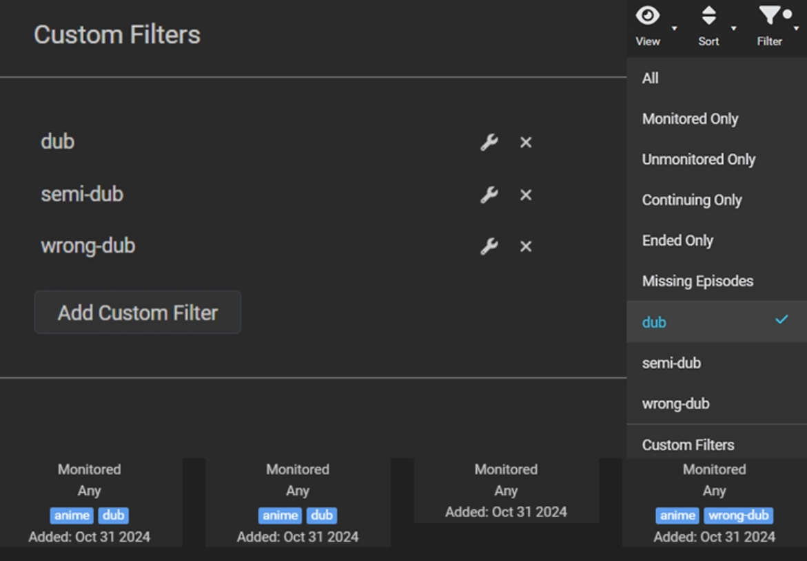
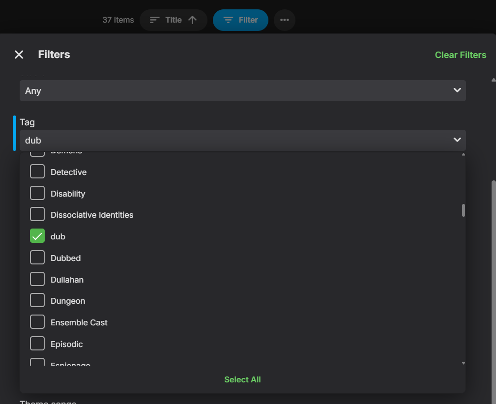
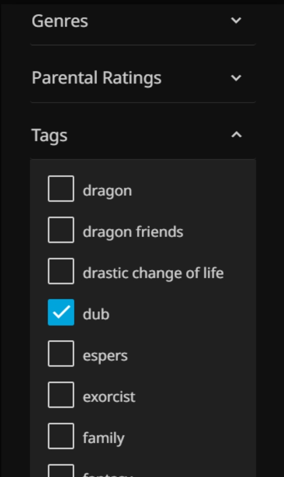

##
_Found this project helpful? Slap that star ⭐️ at the top right corner!_
##
 
</img> 

## TAGGARR

> [!TIP]
> 
> **Don't feel like watching subs?**
>
> **You have no idea which of your content is dubbed?**
>
> **Don't worry, I got you covered.**

Started this project for the exact questions above, that I had. I felt other people could make use of it as well and here we are.

Taggarr is a tool for scanning and tagging your media content whether if your media is dubbed in English, in another language, or containing only original audio using Sonarr and Kodi standard tagging.

The current main purpose of Taggarr, is to have the option to filter your shows based on being dubbed or not using tags within your Sonarr or media player. It also serves the purpose to manage and keep track of which shows are dubbed or wrongly dubbed in another language. 

 

## INFO & QUICK START
> [!NOTE]
> **Features:**
> - **Filter** scan by genre. ie. `Anime` (optional).
> - **Quick** scan option (checks only first video of every season) `QUICK_MODE=true`.
> - **Tags** shows that have all English audio tracks as `dub`. Custon tag supported with `TAG_DUB`.
> - **Tags** shows that have some English audio tracks as `semi-dub`. Custon tag supported with `TAG_SEMI`.
> - **Tags** shows that have non English audio track as `wrong-dub`. Custon tag supported with `TAG_WRONG`.
> - **Interval scans**. Default is every 2 hours. Custom time interval supported with `RUN_INTERVAL_SECONDS`.
> - **JSON** file Taggarr will save the information of your media in a json file located at root folder.
> - Changed your mind? Don't worry, **remove** tags & json file with `ARG_REMOVE=true`.
> - CLI supported as well.

> [!IMPORTANT]
> **Quick Start:**
>
> 1. **Docker**  
> Pull the Docker image from `docker.io/basshous3/taggarr:latest`
> 2. **Config**  
> Make sure to add the root location of your TV content, Sonarr API + URL and the right configs (Check yml file config below).
> 3. **Logs**  
> Add `/var/log/taggarr` as volume for logs. They will be saved under `taggarr.log`.
> 4. **Media players**  
> After tags applied, scan TV libaray's metadata using `Replace all metadata`.

 

## IMPORTANT & DISCLAIMER

> [!WARNING]
> - Currently supporting only English audio as the "correct" dub. Support for other languages will come in the upcoming updates.
>    
> - Currently supporting only Sonarr. Support for Radarr will come in the upcoming updates as well.
> - This project is still in very early stages and can have bugs. Currently only tested on Linux.
> - Coding is only a hobby of mine and I am still learning, use this program at your own discretion.
> - Make sure to read the documentation properly.

 

## CREDITS
Special thanks for inspiration goes to:
- [Cleanuperr](https://github.com/flmorg/cleanuperr)
- [Sonarr](https://github.com/Sonarr/Sonarr) & [Radarr](https://github.com/Radarr/Radarr)

 

## BUY ME COFFEE
Did my work touch your heart ❤️ and wish to contribute a little? consider buying me a warm cup of coffee!

  
## HOW TO USE TAG FILTERING
## Sonarr
</img>
  
## Emby & Jellyfin
</img>  </img> 

