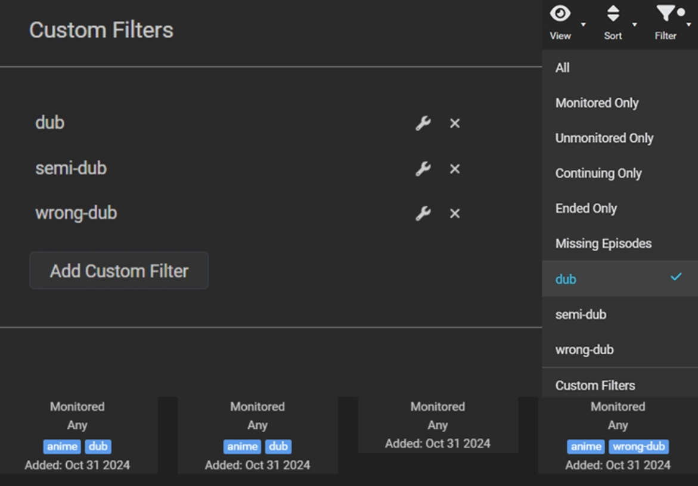
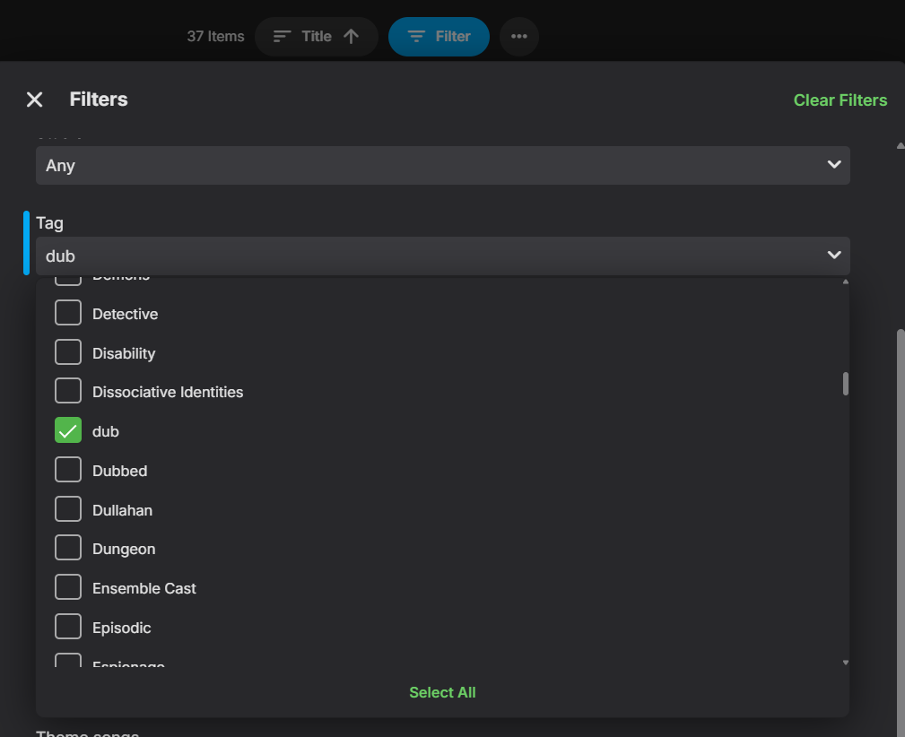
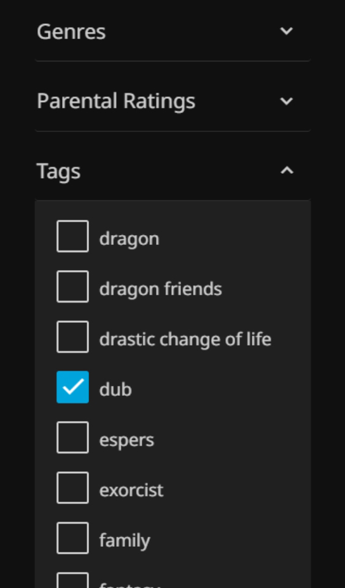

<p align="center">
  </img>
  <p></p>
</p>


> [!TIP]
> 
> - **Don't feel like watching subs?**
>
> - **You have no idea which of your content is dubbed?**
>
> - **Or not sure if Sonarr got the right dub?**
>
> **Don't worry, I got you covered.**

Started this project for the exact same questions. I felt other people could make use of it as well and here we are.

Taggarr is a tool for scanning and tagging your media content whether if your media is dubbed in your language you desire or not. If Taggarr finds another language other than Original Language or your Target Languages, it will mark it as "wrong-dub" using Sonarr and Kodi standard tagging system.

This way, you can filter your shows based on if they're dubbed or not, using tags within your Sonarr (for managing) or any media player that supports tagging (for watching). Taggarr will also save all the information in a JSON file and will tell you which show, season, episode and language is the wrong-dub.
<br></br>
> [!NOTE]
> **How it Works:**
> 
> - `NO TAG` The show is only in its original language.
> - `DUB` The show contains ALL of your target languages.
> - `SEMI-DUB` The show missing at least one of your target languages.
> - `WRONG-DUB` The show contains another language and is missing your target languages (excluding original language).


<br></br>
[](https://discord.com/invite/uggq7JQk89) Need a hand? Have any ideas? Or perhaps feeling some dev vibes? You can now join the Discord server!

<br>

<div align="center">
  
<table>
  <tr>
    <th colspan="3" align="center">Upcoming Updates</th>
  </tr>
  <tr>
    <th>Support for other languages</th>
    <th>Support for Radarr</th>
    <th>Filter scanning by genre</th>
  </tr>
  <tr>
    <td align="center"></td>
    <td align="center"></td>
    <td align="center"></td>
  </tr>
    <tr>
    <th colspan="3" align="center">Support for multiple volumes</th>
  </tr>
  <tr>
    <th colspan="3" align="center"></td>
  </tr>
</table>

</div>
<br>

<h3 align="center"> Found this project helpful? Smash that star ⭐️ at the top right corner! </h3> 
<br><br>

## INFO & QUICK START
> [!NOTE]
> **Features:**
> - Taggarr will save the information of your media in a JSON file located at the root folder of your TV media.
> - Taggarr does not scan the audio of your content. Instead, it reads the name of the audio tracks.
> - Once your library was scanned and indexed in the JSON file, it will only scan for new or modified folders.
> - `QUICK_MODE` `(Bool)` Checks only first video of every season.
> - `TARGET_LANGUAGES` `(Str)` Seperated via comma, you can add multiple languages.
> - `TARGET_GENRE` `(Str)` Filter scan by genre. ie. `Anime`.
> - `TAG_DUB` `(Str)` Custom tag for shows that have all English audio tracks as `dub`.
> - `TAG_SEMI` `(Str)` Custom tag for shows that have some English audio tracks as `semi-dub`.
> - `TAG_WRONG` `(Str)` Custom tag for shows that have non English audio track as `wrong-dub`.
> - `RUN_INTERVAL_SECONDS` `(Int)` Custom time interval. Default is every 2 hours.
> - `DRY_RUN` `(Bool)` Not sure? Try it first, without writing any tags, JSON file will still be saved.
> - `WRITE_MODE` `(Int)` Something not working or changed your mind? Don't worry I got you covered.
> - `WRITE_MODE=0` Works like usual.
> - `WRITE_MODE=1` Rewrites everything, all tags and JSON file.
> - `WRITE_MODE=2` Removes everything, all tags and JSON file.
> - `START_RUNNING` `(Bool)` Start the container without initiating scan for CLI usage.


> [!IMPORTANT]
> **Quick Start:**
>
> 1. **Docker**  
> Pull the Docker image from `docker.io/basshous3/taggarr:latest`
> 2. **Configs**  
> Make sure to use `/tv` as path to your **CONTAINER** (not host). Check out [example of yaml configs](https://github.com/BassHous3/taggarr?tab=readme-ov-file#configuration-example)  below. 
> 3. **Media players**  
> After tags are applied, scan TV's library metadata using `Replace all metadata` method (leave `Replace Images` unchecked).

<br>

## IMPORTANT & DISCLAIMER

> [!WARNING]
> - Currently supporting only English audio as the "correct" dub and Japanese as Original Language. Support for other languages will come in the upcoming updates.
>    
> - Currently supporting only Sonarr. Support for Radarr will come in the upcoming updates as well.
> - This project is still in very early stages and can have bugs. Currently only tested on Linux.
> - Coding is only a hobby of mine and I am still learning, use this program at your own discretion.
> - Make sure to read the documentation properly.

<br>

## CREDITS
Special thanks for inspiration goes to:
- [Cleanuperr](https://github.com/flmorg/cleanuperr)
- [Huntarr](https://github.com/plexguide/Huntarr)
- [Sonarr](https://github.com/Sonarr/Sonarr) & [Radarr](https://github.com/Radarr/Radarr)

<br>

## A CUP OF COFFEE SOUNDS NICE
Did you find my work useful and it touched your heart ❤️? You can show support by a warm cup of coffee!

<a href="https://ko-fi.com/basshouse" target="_blank"></a>

<br>


## CONFIGURATION EXAMPLE

```yaml

name: Taggarr
services:
  taggarr:
      image: docker.io/basshous3/taggarr:latest
      container_name: taggarr
      environment:
        - SONARR_API_KEY=your_api_key #REQUIRED
        - SONARR_URL=http://sonarr:8989 #REQUIRED
        - RUN_INTERVAL_SECONDS=7200 #OPTIONAL - default is 2 hours.
        - START_RUNNING=true #OPTIONAL        
        - QUICK_MODE=false #OPTIONAL 
        - DRY_RUN=false #OPTIONAL 
        - WRITE_MODE=0 #OPTIONAL - 0=NONE, 1=REWRITE, 2=REMOVE
        - TAG_DUB=dub #OPTIONAL
        - TAG_SEMI=semi-dub #OPTIONAL
        - TAG_WRONG_DUB=wrong-dub #OPTIONAL
        - LOG_LEVEL=INFO #OPTIONAL - DEBUG/INFO/WARNING/ERROR
        - TARGET_GENRE=Anime #OPTIONAL - default is all genres
        - TARGET_LANGUAGES=english, french # Supports multiple languages, comma-separated en, fr, de, etc. are also acceptable entries
      volumes:
        - /path/to/your/TV:/tv # Make sure to point your media path host to "/tv" container path
        - /var/log/taggarr:/logs # OPTIONAL - recommended path for logs
      restart: unless-stopped
      logging:
        driver: json-file
        options:
          max-size: "10m"
          max-file: "3"
  
  ```

<details>
<summary><span style="font-size: 10em;"><strong>JSON FILE EXPORT EXAMPLE</strong></span></summary>
  
```json

"/tv/Example Show 1": {
    "display_name": "Example Show 1",
      "tag": "semi-dub",
      "last_scan": "2025-06-26T19:22:11.769510Z",
      "original_language": "japanese",
      "seasons": {
        "Season 1": {
          "episodes": 1,
          "original_dub": ["E01"],
          "dub": ["E01:en"],
          "missing_dub": ["E01:fr"],
          "unexpected_languages": [],
          "last_modified": 1749519136.4969385,
          "status": "semi-dub"
        },
        "Season 2": {
          "episodes": 1,
          "original_dub": ["E01"],
          "dub": ["E01:en"],
          "missing_dub": ["E01:fr"],
          "unexpected_languages": [],
          "last_modified": 1749518483.8193643,
          "status": "semi-dub"
        },
        "Season 3": {
          "episodes": 1,
          "original_dub": ["E01"],
          "dub": [],
          "missing_dub": ["E01:en, fr"],
          "unexpected_languages": [],
          "last_modified": 1750725575.362786,
          "status": "original"
        }
      },
      "last_modified": 1749519136.4969385
    },
"/tv/Example Show 2": {
    "display_name": "Example Show 2",
      "tag": "dub-en,fr",
      "last_scan": "2025-06-26T19:23:55.967659Z",
      "original_language": "french",
      "seasons": {
        "Season 1": {
          "episodes": 1,
          "original_dub": ["E01"],
          "dub": ["E01:en, fr"],
          "missing_dub": [],
          "unexpected_languages": [],
          "last_modified": 1749517909.2880175,
          "status": "fully-dub"
        }
      },
      "last_modified": 1749517909.2880175
},

```
</details>


<details>
<summary><span style="font-size: 10em;"><strong>SCREENSHOTS ON HOW TO USE TAG FILTERING</strong></span></summary>
  

## Sonarr
</img>
<br><br>
## Emby & Jellyfin
</img>  </img> 

</details>


